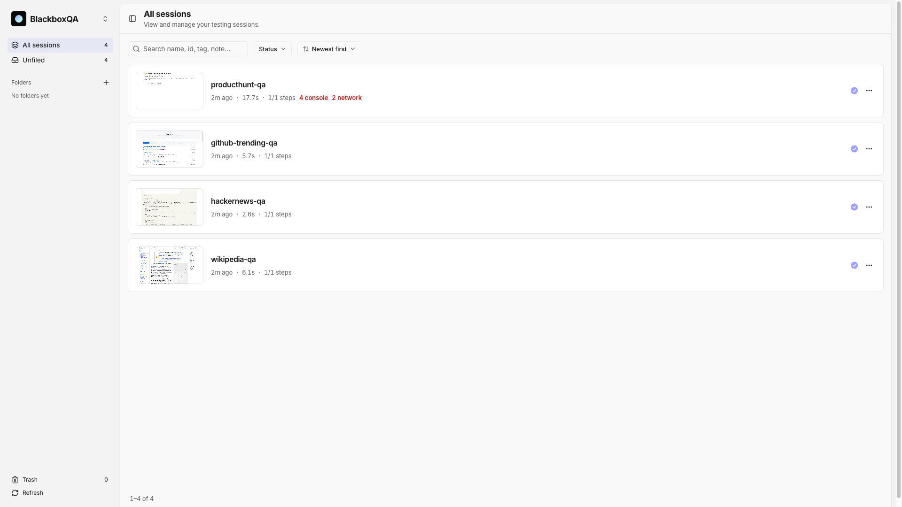
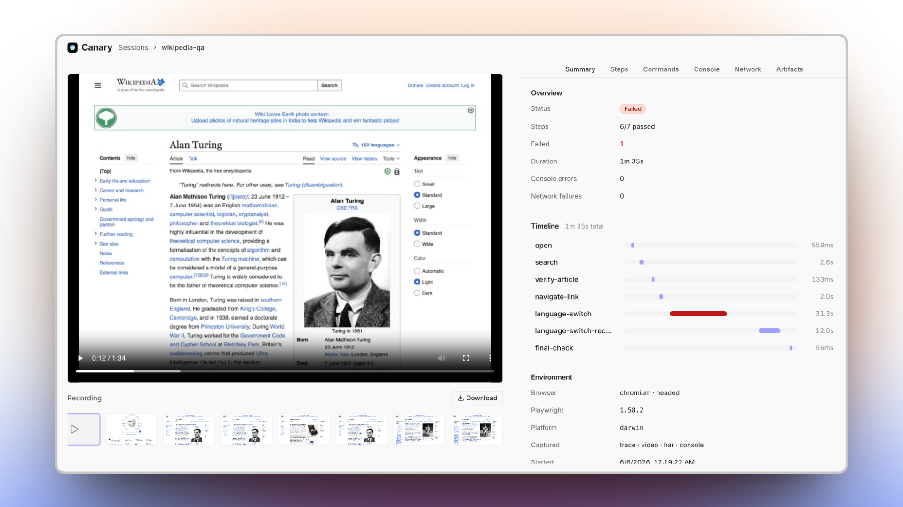
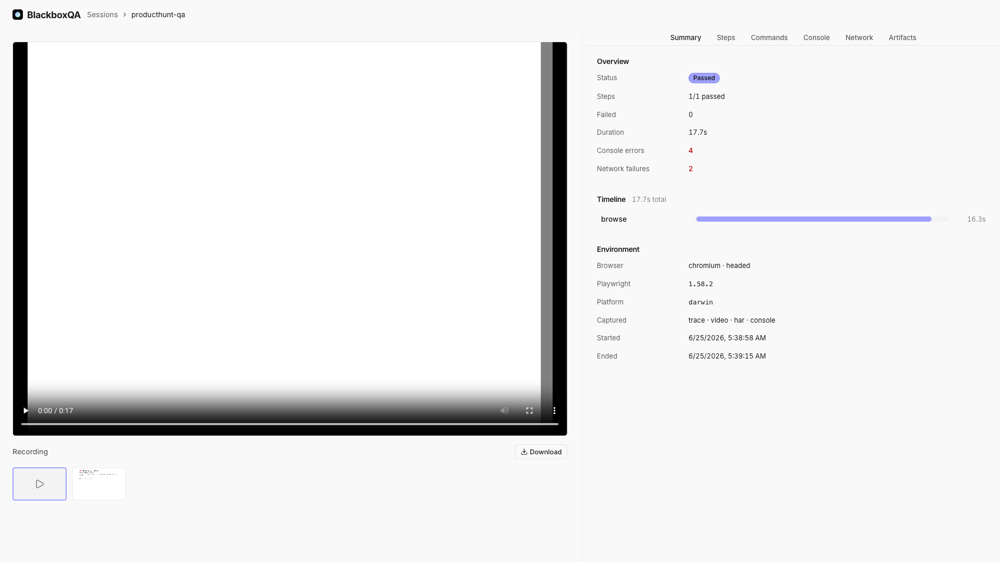
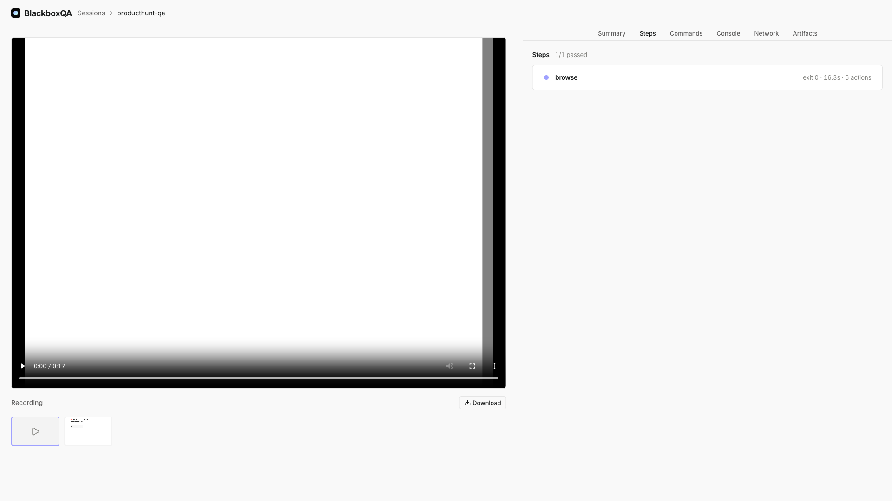
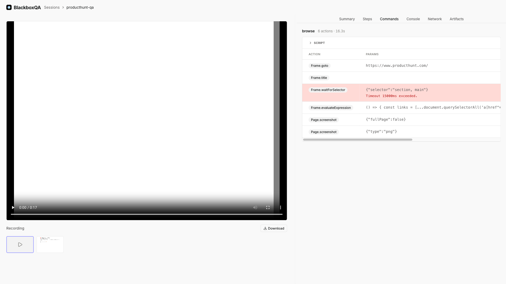
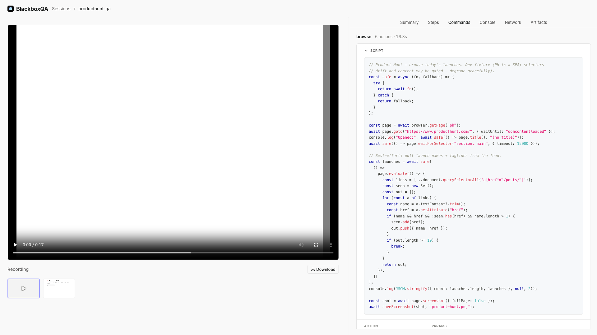
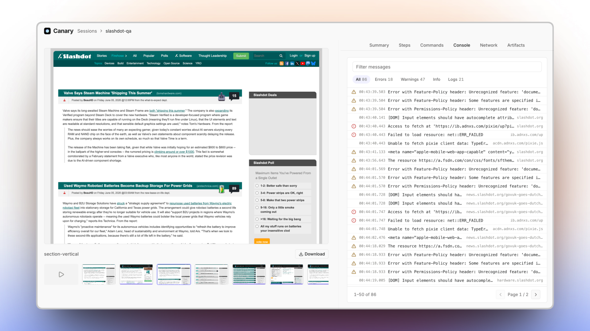
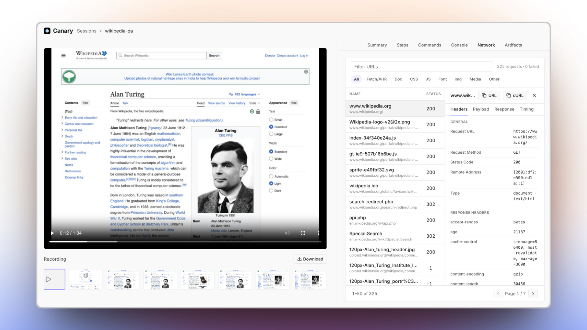
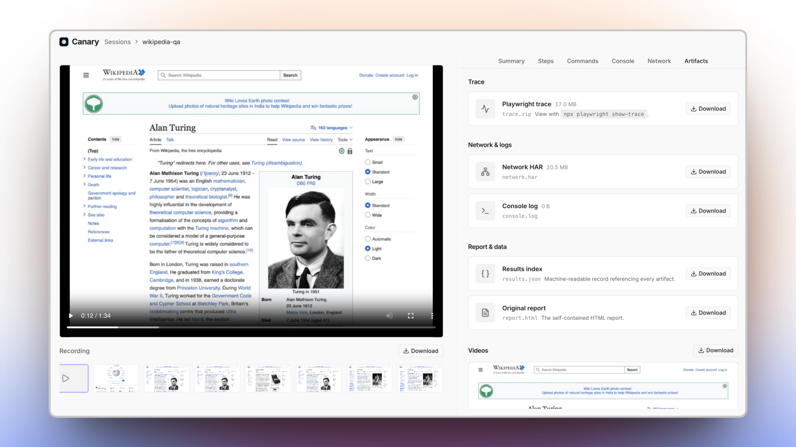

<div align="center">
  <h1>BlackboxQA</h1>
  <p><strong>QA harness built for Claude Code.</strong></p>

  docs/media/hero.mp4
</div>

BlackboxQA is a QA harness purpose built for coding agents like Claude Code. It reads your code diffs, identifies the affected UI flows, and tests them in real browser instances using Claude Code.

Under the hood, it ships with a QuickJS WASM sandbox exposing the full Playwright API, letting Claude automate any long-running UI task — from handling logins to navigating complicated UIs. 

Instead of clicking through flows by hand to reproduce and verify issues, BlackboxQA provides full session recordings. You get screen recordings with console logs, network requests, HARs, and Playwright traces so you can inspect exactly what the agent did.

Every BlackboxQA run captures a reusable Playwright script. Letting you re-run it in CI with zero inference cost on replay.





Most testing tools force you to choose between two extremes:

- An opaque agent run you can't reproduce.
- Raw Playwright scripts you have to write and maintain by hand.

BlackboxQA doesn't make you choose: the agent does the QA and hands you a reproducible script.

## Features



- **See exactly what happened.** Trace, video, network, console, and a screenshot of every step — captured automatically.
- **Reproducible by default.** BlackboxQA turns each run into a real Playwright script. Let your agent discover a flow once; re-run it forever.
- **One file, zero setup.** Every session is a self-contained `report.html` — open it, commit it, send it. No server, no build.
- **Built for agents.** Drop-in plugins for Claude Code, Cursor, and Codex.
- **Sandboxed.** Scripts run in a QuickJS WASM sandbox with the full Playwright `Page` API — no Node, no host access.


## Who it's for

docs/media/session-demo.mp4

You describe the flow in plain language; your agent drives a real browser and hands back **both** a
report you can just read **and** the exact Playwright script — plus the full trace — behind it. Most
tools make you pick one: an opaque agent run you can't reproduce, or raw Playwright you write and
maintain by hand. BlackboxQA gives you both.

| You are a…        | Instead of…                                            | BlackboxQA gives you…                                                                       |
| ----------------- | ------------------------------------------------------ | --------------------------------------------------------------------------------------- |
| **Developer**     | Writing and maintaining Playwright/E2E scripts by hand | A reusable script captured from every run — re-run it in CI, no agent cost on replay    |
| **QA engineer**   | Clicking through flows manually to repro and verify    | Evidence by default — trace, video, network, console, and a screenshot of every step    |
| **PM / reviewer** | Waiting on a build or trusting "works on my machine"   | A self-contained `report.html` you open and read — every step, replayable and shareable |

## Get started

BlackboxQA isn't published to npm — build it from source (it's also available as an agent plugin;
see [Use it with your coding agent](#use-it-with-your-coding-agent)):

```bash
git clone https://github.com/engn-dev/blackboxqa.git
cd blackboxqa
make install   # pnpm install across the workspace
make build     # build every package in topo order
```

Put `blackboxqa` and `blackboxqa-viewer` on your PATH from the local build, then fetch the runtime:

```bash
(cd apps/blackboxqa && pnpm link --global)
(cd apps/blackboxqa-ui && pnpm link --global)
blackboxqa install                          # one-time: Chromium + the runtime into ~/.blackboxqa (~150 MB)
```

Record a session and open the report:

```bash
id=$(blackboxqa session start --name "checkout")
blackboxqa run ./open.js   --session "$id" --step open
blackboxqa run ./submit.js --session "$id" --step submit
blackboxqa session end "$id"                # -> ~/.blackboxqa/sessions/<id>/report.html

blackboxqa-viewer                           # browse every recorded session
blackboxqa stop                             # shut the background daemon down when you're done
```

Just need a quick one-off with no recording? Drive the browser engine directly:

```bash
echo 'const p = await browser.getPage("main");
await p.goto("https://example.com");
console.log(await p.title());' | blackboxqa-browser
```

Or attach to a Chrome you already have open — launch it with `--remote-debugging-port=9222`, then
`blackboxqa-browser --connect` (it auto-discovers the port, or pass the URL explicitly). Handy for driving
a browser that's already logged in:

```bash
blackboxqa-browser --connect http://localhost:9222 <<'EOF'
const page = await browser.getPage("main");
console.log(await page.title());
EOF
```

## Everything your agent does, on the record

Open any session and BlackboxQA replays the whole thing — the page, the script, every Playwright call, the
console, the network, the full trace. Nothing summarized, nothing reconstructed: it's the actual run.
(Every screenshot below is real output.) Capture is on by default; switch any stream off with
`--no-trace` / `--no-video` / `--no-har` / `--no-console`.

### The session at a glance

Status, a per-step timeline, the exact environment, and a full **video replay** of the run with a
filmstrip of per-step screenshots — scrub straight to the moment something happened.




### Step by step

Each step, pass or fail, with its exit code, duration, and how many Playwright actions it ran.




### Reproducible Playwright scripts

This is the one that matters. Let your agent figure a flow out **once** — BlackboxQA keeps the script
behind every step **and** decodes the full Playwright trace into the exact calls it made (`goto`,
`waitForSelector`, `evaluate`, `screenshot`), with params and timing. What you get back is a real,
reusable script. Next time you don't pay an agent to rediscover the page — you just re-run it.







### Console and page errors

Every console message and uncaught page error, filterable by level — errors, warnings, info, logs —
with the source URL. Errors flagged in red.




### Network, request by request

Every request with status, type, size, and timing. Filter by kind, then click any row to inspect its
headers, payload, and response — like a devtools network panel, frozen at the moment it ran.




### The full trace, and every artifact

The raw Playwright `trace.zip`, the network HAR, the console log, the machine-readable `results.json`,
and the self-contained `report.html` — all under `~/.blackboxqa/sessions/<id>/`, all one click away. Open
the trace in Playwright's own viewer with `npx playwright show-trace`.




## Claude Code, natively

In [Claude Code](https://claude.com/claude-code), BlackboxQA is a first-class plugin — skills, subagents,
and `/blackboxqa:*` slash commands. Tell Claude what you changed or what to check; it plans the QA, drives
a real browser, and hands back the report.

```
/blackboxqa:verify    # what changed? → a prioritized QA plan, then record it
/blackboxqa:session   # record a flow end to end and render report.html
/blackboxqa:run       # drive the browser once, nothing recorded
/blackboxqa:review    # open the viewer and triage a recorded session
```

Or skip the slash and just say *"QA the checkout flow and give me a report"* — BlackboxQA's subagents pick
it up. Install the plugin below.

## Use it with your coding agent

BlackboxQA is built for agents — and it explains itself to them. Install it, then **tell your agent to run
`blackboxqa --help`** (or `blackboxqa-browser --help` for one-offs): each output is a complete, self-contained
usage guide — sandbox API, worked examples, a Playwright cheat sheet — written for an LLM to read.
No plugin required.

For deeper integration (slash commands, subagents, and skills), install the plugin pack. BlackboxQA ships
as a Claude Code plugin, a Cursor plugin, and a Codex plugin — all pointing at the same `skills/` +
`agents/` + `commands/`. There's no bespoke installer; each agent's own mechanism does the work.

```bash
# Claude Code
/plugin marketplace add engn-dev/blackboxqa
/plugin install blackboxqa@blackboxqa-marketplace

# Cursor — install "blackboxqa" from the Marketplace, or symlink for local dev:
ln -sfn "$(pwd)" ~/.cursor/plugins/local/blackboxqa

# Codex
codex marketplace add engn-dev/blackboxqa        # then /plugins → install "blackboxqa"
```

You get **`blackboxqa-scripting`** (the sandbox API, with `references/REFERENCE.md`) plus the workflow
skills **`blackboxqa-verify`**, **`blackboxqa-automate`**, **`blackboxqa-session`**, and **`blackboxqa-review`** —
each paired with a subagent and a slash command: `/blackboxqa:verify`, `/blackboxqa:run`, `/blackboxqa:session`,
`/blackboxqa:review`.

## Three tools, one runtime

| Tool                            | Command                            | Use it to                                                                          |
| ------------------------------- | ---------------------------------- | ---------------------------------------------------------------------------------- |
| **CLI** `@blackboxqa/cli`        | `blackboxqa`                           | Record capture-enabled QA sessions and render reports. The main, user-facing tool. |
| **Engine** `@blackboxqa/browser` | `blackboxqa-browser`                   | Drive a browser for quick, one-off automation — no recording, no report.           |
| **Viewer** `@blackboxqa/ui`      | `blackboxqa-viewer` | Browse, search, organize, and replay every recorded session locally.            |

Both CLIs share one background daemon (Playwright + a QuickJS sandbox) that starts automatically when
needed. Stop it anytime with **`blackboxqa stop`** (alias: `blackboxqa daemon stop`, or `blackboxqa-browser stop`) —
it shuts down every browser and session it's running. You can also pass `--stop-daemon` to
`blackboxqa session end` to tear it down as soon as nothing else needs it.

## Scripting

Scripts are plain async JavaScript with top-level `await`.

<!-- blackboxqa:snippet api-sandbox-env -->
Scripts execute inside a QuickJS WASM sandbox with no arbitrary access to the host system.
This is NOT Node.js — there is no module system and no Node API:

- `require()` / `import()` — no module loading; inline any helpers in the script
- `process`, `fs` / `path` / `os` — no process or direct filesystem access (use the file helpers)
- `fetch` / `WebSocket` — no direct network access (the page does the networking)
- `__dirname` / `__filename` — no path globals

Memory and CPU limits are enforced, and both CPU time and wall-clock time are bounded — infinite
loops or never-settling promises abort the script. Values crossing `evaluate` / `$eval` must be
JSON-serializable.
<!-- blackboxqa:end api-sandbox-env -->

<!-- blackboxqa:snippet ex-quickstart fenced=js -->
```js
const page = await browser.getPage("main");          // named, persistent page
await page.goto("https://example.com", { waitUntil: "domcontentloaded" });
console.log(await page.title());

const headings = await page.evaluate(() =>
  [...document.querySelectorAll("h1, h2")].map((h) => h.textContent.trim())
);
console.log(JSON.stringify(headings));

await page.locator("a.more").click();
const buf = await page.screenshot({ fullPage: false });
await saveScreenshot(buf, "page.png");               // saveScreenshot(buffer, name)
```
<!-- blackboxqa:end ex-quickstart -->

**Browser**

<!-- blackboxqa:snippet api-browser -->
- `browser.getPage(nameOrId)` — get-or-create a named page, or attach to an existing tab by the
  `id` from `listPages()`. Named pages persist across steps in a session — call with the same
  name to reuse the tab.
- `browser.newPage()` — an anonymous page, auto-closed when the script ends; does not persist.
- `browser.listPages()` — list every open tab: `[{ id, url, title, name }]` (`name` is `null`
  for tabs you never named).
- `browser.closePage(name)` — close and forget a named page.
<!-- blackboxqa:end api-browser -->

**Files**

<!-- blackboxqa:snippet api-file-helpers -->
All file I/O is async (await it), sandboxed to `~/.blackboxqa/tmp/` (no filesystem escape), and
returns the full path to the file:

- `saveScreenshot(buffer, name)` — persist a screenshot buffer; buffer first:
  `const path = await saveScreenshot(await page.screenshot(), "home.png");`
- `writeFile(name, data)` — write a small file (e.g. JSON state):
  `await writeFile("results.json", JSON.stringify(data));`
- `readFile(name)` — read it back (returns the contents as a string):
  `const data = JSON.parse(await readFile("results.json"));`
<!-- blackboxqa:end api-file-helpers -->

**Output**

<!-- blackboxqa:snippet api-console -->
- `console.log` / `console.info` write to stdout; `console.warn` / `console.error` write to
  stderr. Top-level `console.log` is your script's output channel.
- `console.log` inside `page.evaluate(() => …)` runs in the page and is captured into the
  session's console artifact instead.
<!-- blackboxqa:end api-console -->

<!-- blackboxqa:snippet api-playwright-note -->
Pages returned by `browser.getPage()` and `browser.newPage()` are full Playwright Page objects —
the same API (`goto`, `click`, `fill`, `locator`, `evaluate`, `getByRole`, `waitForSelector`, …):
https://playwright.dev/docs/api/class-page
<!-- blackboxqa:end api-playwright-note -->

For element discovery, `await page.snapshotForAI()` returns an LLM-friendly outline of the page —
the `blackboxqa-scripting` skill and its `references/REFERENCE.md` carry the full API.

## Updating

Pull the latest and rebuild:

```bash
git pull
make install && make build
blackboxqa install        # refresh the runtime (Chromium + Playwright) if the pinned version changed
```

`blackboxqa install` is safe to re-run — it pulls the browser/runtime versions the build pins.

**Agent integrations** update through each agent's own mechanism:

```bash
# Claude Code — refresh the marketplace catalog, then update from /plugin:
/plugin marketplace update blackboxqa-marketplace

# Cursor / Codex — update "blackboxqa" from each marketplace UI.
```

## Contributing & development

BlackboxQA is a pnpm + Turborepo monorepo: five apps and five packages cooperate to make agent-driven
browser automation reproducible.

<details>
<summary><strong>Repo layout</strong></summary>

```
blackboxqa/
├── apps/
│   ├── blackboxqa/             # @blackboxqa/cli      bin: blackboxqa          — session orchestrator (record QA sessions, render reports)
│   ├── blackboxqa-browser/     # @blackboxqa/browser  bin: blackboxqa-browser  — browser-automation engine (one-off runs)
│   ├── blackboxqa-daemon/      # @blackboxqa/daemon   no bin               — Playwright + QuickJS runtime (embedded into the CLIs)
│   ├── blackboxqa-ui/          # @blackboxqa/ui       bin: blackboxqa-viewer   — local session viewer (Astro); `blackboxqa-viewer`
│   └── create-blackboxqa/      # create-blackboxqa    bin: create-blackboxqa   — guided setup wizard (Ink)
├── packages/
│   ├── protocol/           # @blackboxqa/protocol         IPC schemas (Zod), single source of truth
│   ├── config/             # @blackboxqa/config           shared tsconfig bases
│   ├── logger/             # @blackboxqa/logger           pino-backed structured logger
│   ├── cli-kit/            # @blackboxqa/cli-kit          shared CLI helpers
│   └── daemon-client/      # @blackboxqa/daemon-client    daemon transport + lifecycle; embeds the daemon bundle
├── skills/                 # agent skills: blackboxqa-scripting (+references), -verify, -automate, -session, -review
├── agents/                 # JTBD subagents: verify-agent, automate-agent, session-agent, review-agent
├── commands/               # slash commands: /blackboxqa:verify, :run, :session, :review
├── .claude-plugin/         # Claude Code plugin + marketplace manifests
├── .cursor-plugin/         # Cursor plugin manifest (pairs with rules/)
├── plugins/blackboxqa/         # Codex plugin wrapper (.codex-plugin → canonical skills/)
├── .agents/                # Codex / agents marketplace manifest
├── rules/                  # Cursor rules (blackboxqa-workflows.mdc)
├── examples/               # dev-only demo scripts (Hacker News, Product Hunt, GitHub Trending, Wikipedia)
└── .github/                # CI
```

`blackboxqa` (the orchestrator) and `blackboxqa-browser` (the engine) both embed and supervise
`blackboxqa-daemon` (the long-running Playwright host). The viewer ships standalone — `blackboxqa-viewer`.

</details>

<details>
<summary><strong>Build, test &amp; conventions</strong></summary>

```bash
make install   # pnpm install across the workspace
make build     # build everything in topo order
make test      # run all tests
make check     # compile + lint + test (what CI runs)
```

Run `make` with no args to see all targets.

- **Conventional Commits** enforced via `commitlint` + a husky `commit-msg` hook.
- **Linting & formatting** via [Ultracite](https://docs.ultracite.ai/) (Biome) — `pnpm lint` checks, `pnpm format` autofixes; pre-commit runs `lint-staged` → `ultracite fix` on staged files.
- **Logging** via `@blackboxqa/logger` (pino, structured). Set `BBQA_LOG_LEVEL` (trace|debug|info|warn|error|silent); the CLI also accepts `--verbose`/`-v`.
- **Node 20+** and **pnpm 9.15.0** (see `.nvmrc` and `packageManager`).
- **Turbo** orchestrates builds (`turbo run build`, `dev`, `test`, `compile`); lint/format run via Ultracite at the root.

</details>

See [`AGENTS.md`](AGENTS.md) for architecture and orientation and
[`CONTRIBUTING.md`](CONTRIBUTING.md) for the contribution flow.

## License

MIT. BlackboxQA's daemon and CLIs are derived in part from MIT-licensed work by
[Sawyer Hood](https://github.com/SawyerHood) — see [`LICENSE`](LICENSE).
